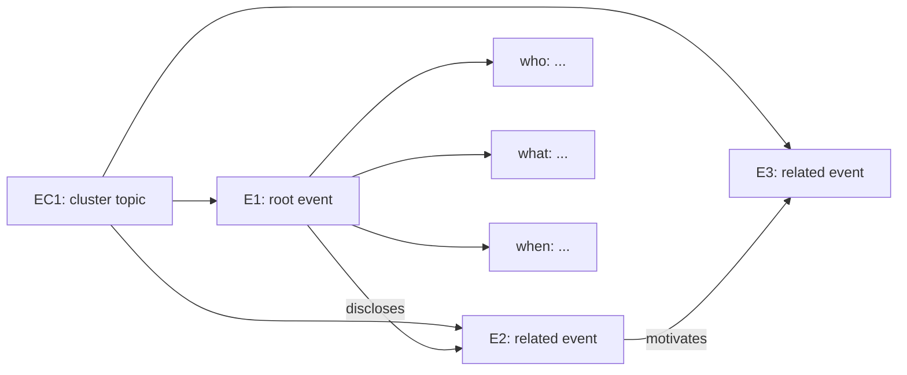

# Diagram Guide

Use Mermaid when the user asks to draw or explain the graph.

## Compact Cluster Diagram

## Diagram Rules

- Show `EC*` clusters.
- Show `E*` events.
- Show relation labels on event-to-event edges.
- Show only the root event's key 5W1H nodes unless full detail is requested.
- Keep labels short.
- Use controlled relation names.
