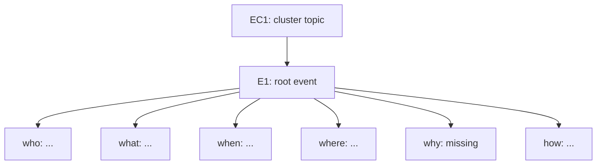
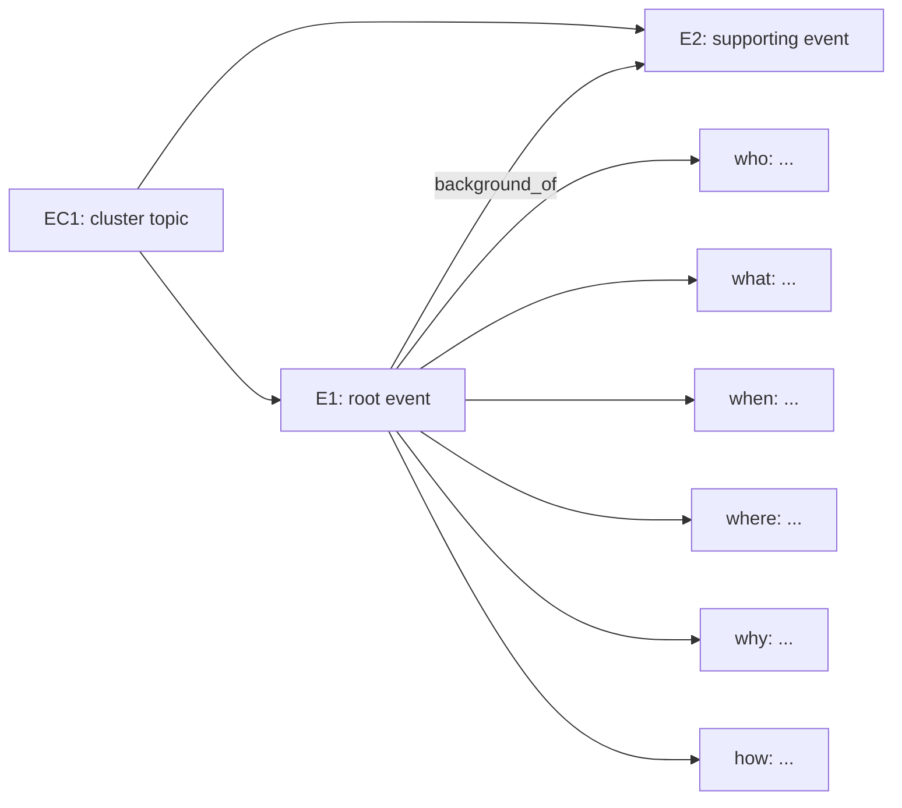

# Diagram Guide

Use Mermaid when the user asks to draw or explain the graph.

## Non-Negotiable Diagram Contract

A CEH-5W1H diagram must still show 5W1H extraction.

For every displayed root event, include all six role nodes:

```text
who
what
when
where
why
how
```

If a role is not stated, show `missing`. Do not silently omit it.

When there are many clusters, use one of these layouts:

- an overview diagram plus a 5W1H table for all root events;
- multiple Mermaid diagrams, each covering 1-3 clusters;
- compact event-card subgraphs where each root event connects to six role nodes.

Do not output only an event relation diagram. Do not use `B1`, `B2`, or other background nodes as a substitute for 5W1H nodes.

## Compact Event-Card Diagram



## Cluster Relation Diagram With 5W1H

Use relation edges only after the root event's 5W1H roles are visible.



## Diagram Rules

- Show `EC*` clusters.
- Show `E*` events.
- Show all six 5W1H role nodes for root events.
- Show relation labels on event-to-event edges.
- Keep labels short.
- Use controlled relation names.
- Split large outputs instead of deleting 5W1H roles.
